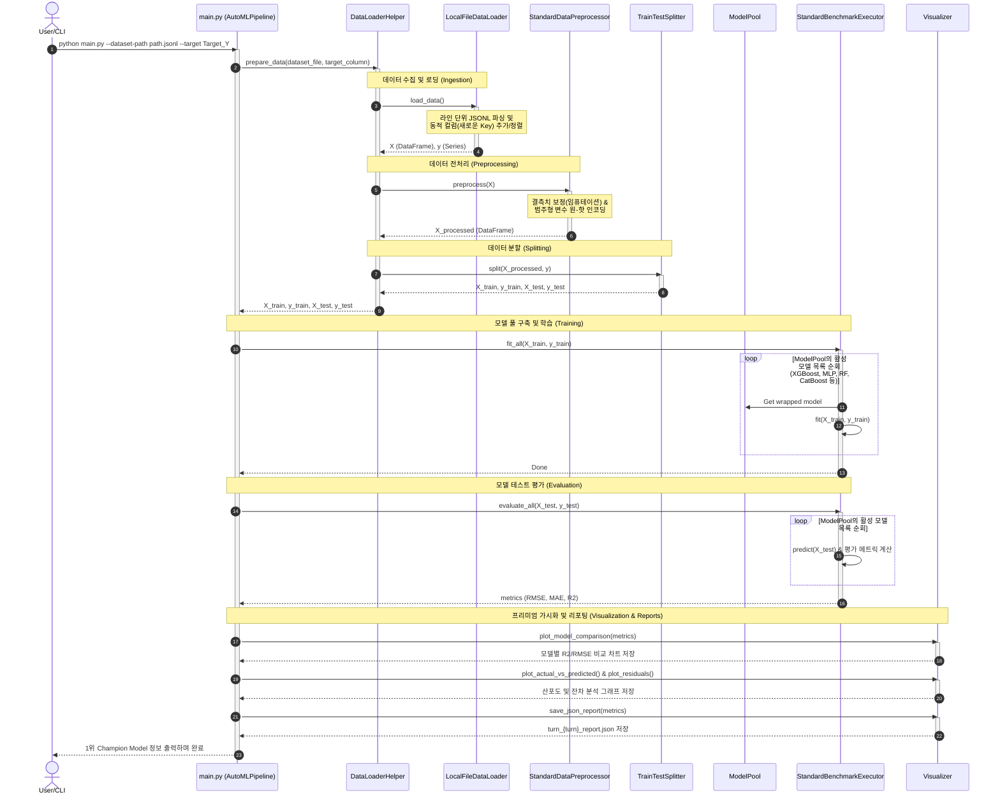

# AutoML Regression Framework Architecture

본 문서는 **AutoML Regression Framework**의 모듈 및 클래스 구조, 데이터 흐름, 그리고 이들 간의 상호작용 관계를 텍스트 기반 다이어그램과 함께 상세히 설명합니다.

---

## 1. High-Level Architecture Diagram (아키텍처 다이어그램)

아래 다이어그램은 프레임워크의 핵심 실행 제어 흐름과 데이터의 파이프라인 처리 과정을 텍스트(ASCII/Unicode Art)로 시각화한 것입니다.

```text
                    ┌───────────────────────────────┐
                    │           config.yml          │ (Central Configuration)
                    └───────────────┬───────────────┘
                                    │ Loads Dynamic Settings (active_models, hyperparams)
                                    ▼
                    ┌───────────────────────────────┐
                    │     CLI / User Entry Point    │
                    │         (root/main.py)        │
                    └───────────────┬───────────────┘
                                    │ Instantiates & Runs
                                    ▼
                    ┌───────────────────────────────┐
                    │        AutoMLPipeline         │
                    │   (Orchestrator inside main)  │
                    └──────┬────────┬────────────┬──┘
                           │        │            │
              ① Load &     │        │ ② Fit &    │ ③ Metrics & Predictions
              Preprocess   │        │ Evalu-     │    for Premium Reports
              Data         ▼        │ ate        ▼
                                    │
┌──────────────────────────────┐    │    ┌──────────────────────────────┐
│      DataLoaderHelper        │    │    │         Visualizer           │
│  (automl_framework/          │    │    │  (automl_framework/          │
│   dataloader/                │    │    │   util/visualizer.py)        │
│   data_loader_helper.py)     │    │    ├──────────────────────────────┤
├──────────────────────────────┤    │    │ - plot_actual_vs_predicted() │
│ - download_from_kaggle()     │    │    │ - plot_residuals()           │
│ - download_from_url()        │    │    │ - plot_model_comparison()    │
│ - load_dataset()             │    │    │ - save_json_report()         │
│ - preprocess_data()          │    │    └──────────────────────────────┘
│ - split_data()               │    │
│ - prepare_data()             │    │
│  (Delegates to modular       │    │
│   strategies under-the-hood) │    │
└──────────────────────────────┘    │
                                    ▼
┌───────────────────────────────────────────────────────────────────────────┐
│                         StandardBenchmarkExecutor                         │
│                  (automl_framework/model/model_executor.py)               │
├───────────────────────────────────────────────────────────────────────────┤
│ - fit_all(X_train, y_train)                                               │
│ - evaluate_all(X_test, y_test) -> metrics (RMSE, MAE, R2)                 │
│ - get_predictions(X) -> dict of predictions                               │
└──────────────────────────────────────┬────────────────────────────────────┘
                                       │
                                       │ Operates on Dynamically Configured Inventory
                                       ▼
┌───────────────────────────────────────────────────────────────────────────┐
│                                 ModelPool                                 │
│                   (automl_framework/model/model_pool.py)                  │
├───────────────────────────────────────────────────────────────────────────┤
│ - models: Dict[str, ABCModelWrapper]                                      │
│ - _initialize_default_models() -> Bootstraps via config.yml active_models │
│ - add_custom_model(name, model_instance)                                  │
│ - list_available_models()                                                 │
└──────────────────────────────────────┬────────────────────────────────────┘
                                       │
                                       │ Stores & Standardizes
                                       ▼
                    ┌──────────────────────────────────────┐
                    │             ModelWrapper             │
                    │   (automl_framework/model/wrappers.py)   │
                    ├──────────────────────────────────────┤
                    │ - fit(X, y)                          │
                    │ - predict(X)                         │
                    └──────────────────┬───────────────────┘
                                       │
               ┌───────────────┬───────┴───────┬───────────────┐ Instantiates & Adapts
               ▼               ▼               ▼               ▼
      ┌─────────────────┐┌───────────────┐┌─────────────────┐┌─────────────────┐
      │   XGBoost / RF  ││   MLP (NN)    ││     TabPFN      ││   Transformer   │
      │ (xgboost/sklearn││(scikit-learn) ││    (tabpfn)     ││ (PyTorch Model) │
      ```

### 1.2. 세부 호출 흐름도 (Detailed Call Sequence Diagram)

아래의 시퀀스 다이어그램은 CLI 오케스트레이터(`main.py` -> `AutoMLPipeline`)의 시작부터 데이터 ingestion, 전처리, 스플릿, 그리고 동적 `ModelPool`의 일괄 학습 및 시각화/최종 레포트 저장까지의 상세 실행/호출 관계를 보여줍니다.



---

## 2. Directory Structure (디렉토리 구조)

프로젝트 루트 디렉토리의 전체 레이아웃과 핵심 소스 파일 위치는 다음과 같습니다.

```text
regression-model-revolution-framework/
│
├── main.py                         # 프로젝트 전체 실행 진입점 (CLI Orchestrator)
├── configs/                        # 📂 설정 프로파일 보관소 (다양한 실험을 위한 YAML 구성 파일들)
│   ├── default.yml                 # 기본 설정 프로파일 (기존 config.yml 이관)
│   ├── kfold_split.yml             # 교차 검증(K-Fold Split) 실험 설정 프로파일
│   ├── timeseries_split.yml        # 시계열 분할(TimeSeries Split) 실험 설정 프로파일
│   └── custom_features.yml         # 커스텀 피처 변수 지정 실험 설정 프로파일
│
├── scripts/                        # 🏃 시나리오별 파이프라인 일괄 실행 스크립트 디렉토리
│   ├── run_local_csv.sh            # 로컬 CSV 데이터셋 학습 실행기
│   ├── run_local_jsonl.sh           # 로컬 JSONL 데이터셋(동적 컬럼 지원) 학습 실행기
│   └── run_url.sh                  # 원격 HTTP URL 파일 다운로드 후 학습 실행기
│
├── automl_framework/               # 프레임워크 메인 패키지
│   ├── __init__.py                 # 패키지 파사드 진입점 (DataLoaderHelper, ModelPool, Visualizer, Executor 외부 노출)
│   │
│   ├── dataloader/                 # 데이터 처리 서브패키지 (Data Domain)
│   │   ├── __init__.py
│   │   ├── loaders.py              # 데이터 로더 추상 베이스 클래스 및 로컬/원격 로더 구현체
│   │   ├── preprocessors.py        # 전처리기 추상 베이스 클래스 및 결측치/인코딩 구현체
│   │   ├── splitters.py            # 데이터셋 분할기 추상 베이스 클래스 및 구현체
│   │   └── data_loader_helper.py   # 기존 규격을 호환하는 퍼사드(Facade) DataLoaderHelper 및 파이프라인 일괄 준비
│   │
│   ├── model/                      # 머신러닝 학습 서브패키지 (Model Domain)
│   │   ├── __init__.py
│   │   ├── model_pool.py           # 모델 저장소(ModelPool)
│   │   ├── model_executor.py       # 추상 실행기(ABCModelExecutor) 및 일괄 벤치마크 실행기(StandardBenchmarkExecutor)
│   │   ├── wrappers.py             # 개별 모델 규격 어댑터 (Wrapper)
│   │   └── architecture/           # 딥러닝/신경망 모델 아키텍처 정의
│   │       └── transformer_encoder.py # 시퀀스 기반 트랜스포머 회귀 모델 (TransformerBasedRegression)
│   │
│   └── util/                       # 분석/유틸리티 서브패키지 (Utility Domain)
│   │   ├── __init__.py
│   │   └── visualizer.py           # 프리미엄 차트 생성 및 JSON 실행 보고서 작성
│   │
│   └── README.md                   # 패키지 명세서
│
├── tests/                          # 🧪 종합 테스트 스위트
│   ├── __init__.py
│   ├── test_dataloader.py          # 데이터 처리, JSONL 동적 스키마 로딩 및 분할 기능 테스트
│   ├── test_model.py               # 모델 초기화, 수동 등록 및 실행기 테스트
│   └── test_visualizer.py          # 시각화 및 리포트 작성 테스트
│
├── data/                           # 📂 (자동 생성) 다운로드되거나 생성된 데이터셋 저장소
│   ├── synthetic_regression.csv    # 시각화 검증용 모의 회귀 데이터셋 (CSV)
│   ├── synthetic_regression.jsonl   # 새로 추가된 정형 JSON Lines 데이터셋 (JSONL)
│   └── SECOM_Full_Dataset.csv      # SECOM 가설 검증용 원본 데이터셋
│
├── outputs/                        # (자동 생성) 시각화 이미지(.png) 및 JSON 실행 보고서 저장소
│
├── .gitignore                      # Git 제외 목록 설정 파일
├── LICENSE                         # Apache 라이선스 파일
├── README.md                       # 프로젝트 기본 설명서
└── ARCHITECTURE.md                 # [본 파일] 시스템 아키텍처 명세서
```

---

## 3. Core Modules & Classes (핵심 모듈 및 클래스 구성)

프레임워크는 각 역할에 따라 단일 책임 원칙(Single Responsibility Principle)을 준수하는 모듈들로 설계되었습니다.

### A. CLI 및 전체 설정 제어: 루트 `main.py` 및 `configs/`
* **역할**: CLI 명령줄 인수를 안전하게 처리하고, 전체 AutoML 프로세스를 단일 클래스로 캡슐화하여 일괄 제어하는 오케스트레이션 엔진입니다.
* **`AutoMLPipeline` 클래스 핵심 메서드**:
  - **`__init__(config_path, turn, target, test_size)`**: 셸 및 CLI 오버라이드 인수(target, test_size)와 YAML 프로파일 설정을 조율하여 `DataLoaderHelper`, `ModelPool`, `StandardBenchmarkExecutor`, `Visualizer` 컴포넌트들을 통일화되어 초기화하고 실행 상태들을 멤버 변수로 관리합니다.
  - **`_load_config(config_path) -> dict` [Static]**: 지정된 YAML 파일을 로드하며, 부재 시 빈 딕셔너리로 안전 우회하는 예외 안전망을 가집니다.
  - **`prepare_data(dataset_path, kaggle_dataset, url)`**: Ingestion 모듈을 제어해 로컬/원격 파일을 준비하고 전처리 및 스플리팅을 거쳐 학습/테스트 변수 상태를 갱신합니다.
  - **`train_and_evaluate() -> dict`**: 활성 모델 전체에 대한 훈련을 일괄 위임하고 테스트 평가 메트릭(RMSE, MAE, R2)을 사전 형태로 저장합니다.
  - **`generate_reports()`**: 프리미엄 시각화 플롯 차트 생성, 잔차 오차 산포도 렌더링, 성능비교 바 플롯 작성 및 최적 챔피언 결과 JSON 레포트 아카이빙을 총괄 실행합니다.
  - **`run(...)`**: 위의 데이터 로딩, 학습, 레포팅을 단 한 줄로 순차 오케스트레이션하여 일괄 처리하는 마스터 인터페이스입니다.
* **독립 도우미 및 진입 함수**:
  - **`parse_arguments() -> argparse.Namespace`**: CLI 명령줄 전용 인수를 안전하게 파싱합니다.
  - **`main()`**: CLI 사용 목적의 셸 진입 래퍼로, `AutoMLPipeline`을 생성한 뒤 `pipeline.run(...)`을 안전 예외 블록 내에서 1회 호출해 구동시킵니다.
* **동작 분기 및 이점**:
  - 설정 파일들이 `configs/` 디렉토리에 실험 목적에 따라 보관되어 있으며, `--config configs/kfold_split.yml` 등의 지정만으로 코딩 없이 파이프라인 제어 정책이 적용됩니다.
  - 객체화로 인해 다른 파이선 모듈이나 대시보드 애플리케이션에서도 `from main import AutoMLPipeline`을 통해 손쉽게 라이브러리로써 호출해 구동할 수 있습니다.

---

### B. 데이터 로더 및 전처리 모듈: `automl_framework/dataloader/`
#### `DataLoaderHelper` (Facade Class) 및 전략 클래스들
* **책임**: 데이터 획득(Kaggle, HTTP URL)부터 학습 전 단계까지의 모든 데이터 처리를 담당합니다. `DataLoaderHelper` 클래스는 파사드(Facade) 역할을 하며 하위의 모듈화된 전략(Strategy) 클래스들에게 실제 처리를 위임합니다.
* **핵심 메서드**:
  * `fetch_dataset(dataset_path, kaggle_dataset, url)`: 로컬 파일 경로, Kaggle 데이터셋 명칭, 혹은 UCI HTTP URL을 인자로 주입받아, Ingestion 모듈을 제어하여 원격/로컬 파일을 안전하게 다운로드하고, 유효성이 검증된 로컬 절대 경로를 반환합니다.
  * `prepare_data(dataset_file, target_column, test_size, random_state)`: 데이터 로딩, 결측치 임퓨테이션 및 원-핫 인코딩 전처리, train/test 스플릿 분할 프로세스를 내부적으로 통합 오케스트레이션하여 피팅 및 평가에 최적화된 학습/테스트 분할 데이터셋을 직접 생산해 반환하는 메인 퍼사드 메소드입니다.
* **하위 전략 클래스 구성**:
  * **데이터 로더 (`loaders.ABCDataLoader`, `loaders.py`)**:
    * `LocalFileDataLoader`: 로컬 CSV, TSV, Parquet, 그리고 JSONL 포맷 데이터를 판다스 데이터프레임으로 자동 읽어 들이고 독립 변수(X)와 종속 변수(y)로 분리합니다. 특히 JSON Lines(`.jsonl`) 포맷의 경우, 행마다 누락된 값이 있어 키 분포가 다른 특성을 극복하기 위해 라인 단위 파싱 중 새로운 키(컬럼)가 발견될 때마다 동적으로 컬럼을 추가/확장 및 정렬하여 판다스 데이터프레임으로 안전하게 통합 로드(결손 부위는 `NaN` 매핑)하는 지능형 스키마 로딩을 제공합니다.
    * `KaggleDataLoader`: Kaggle API를 사용하여 원격 데이터셋을 다운로드하고 압축을 해제합니다.
    * `URLDataLoader`: 외부 웹 서버(예: UCI 머신러닝 리포지토리)에서 직접 데이터셋 파일을 가져옵니다.
  * **전처리기 (`preprocessors.ABCDataPreprocessor`, `preprocessors.py`)**:
    * `StandardDataPreprocessor`: 결측치 보정(수치형은 중앙값, 범주형은 최빈값 임퓨테이션) 및 범주형 변수의 원-핫 인코딩(Dummy Encoding)을 자동으로 수행합니다.
  * **분할기 (`splitters.ABCDataSplitter`, `splitters.py`)**:
    * `TrainTestSplitter`: 학습, 검증, 테스트 셋으로 데이터를 안정적으로 분할합니다.
    * `KFoldSplitter`: K-Fold 교차 검증을 지원하며, AutoML 벤치마크 규격에 맞게 분할 데이터를 안정적으로 반환합니다.
    * `TimeSeriesSplitter`: 시간 순서에 근거한 시계열 데이터셋 분할(TimeSeriesSplit)을 지원합니다.

---

### C. 모델 관리 및 실행 전략 모듈: `automl_framework/model/`
#### `ModelPool` (Class, `automl_framework/model/model_pool.py`)
* **책임**: 알고리즘군(Tree 기반, 신경망 기반, 사전 학습 기반 등)의 모델 객체를 보유하는 데이터 저장소(Inventory Container)입니다.
* **핵심 메서드**:
  * `_initialize_default_models()`: `config.yml` 내 `active_models` 목록에 정의된 모델들만 필터링하여 생성자에 설정 하이퍼파라미터(`config["models"][ModelName]`)들을 동적으로 주입하여 초기화합니다.

#### `TransformerBasedRegression` (PyTorch Module, `automl_framework/model/architecture/transformer_encoder.py`)
* **책임**: 시퀀스 데이터를 처리하여 회귀 예측을 수행하는 PyTorch 기반 모델입니다.
* **핵심 기능**:
  - **시퀀스 부호화**: 내부 `TransformerBasedEncoder`와 learnable positional embedding을 활용한 sequence 데이터 인코딩.
  - **풀링 레이어**: 시퀀스 길이를 변환하기 위한 `mean`, `max`, `last` 풀링 옵션 제공 및 패딩 토큰을 제외하기 위한 boolean mask 연동 지원.
  - **다목적 회귀 헤드**: 
    - 기본 예측 모드: 단일 scalar 예측 (`predict_distribution=False`).
    - 확률 분포 모드: 평균(mean)과 strictly positive 분산(variance) 예측 (`predict_distribution=True`).

#### `ModelWrapperTransformer` (Class, `automl_framework/model/wrappers.py`)
* **책임**: `TransformerBasedRegression` PyTorch 모델을 Scikit-Learn과 호환되는 일관된 `fit(X, y)` 및 `predict(X)` 형태로 감싸주는 **어댑터(Adapter) 모델 Wrapper**입니다.
* **핵심 기능**:
  - **입력 전처리 및 3D 형상 복원**: 2D pandas DataFrame이나 numpy array가 입력될 때, 이를 트랜스포머 시퀀스 형태인 3D Tensor `(batch_size, num_features, 1)` 또는 `(batch_size, 1, num_features)` 형태로 자동 복원하여 전달합니다.
  - **신경망 학습 루프 (AdamW)**: 설정된 `epochs`, `learning_rate`, `batch_size`를 기반으로 미니배치를 수행하며 PyTorch의 순방향/역방향 전파를 수행합니다.
  - **확률 모델 지원 (Gaussian NLL Loss)**: `predict_distribution=True` 일 때 가우시안 음의 로그 우도(Negative Log-Likelihood) 손실 함수를 동적으로 연동하여 평균과 분산을 학습시킵니다. `predict()` 호출 시에는 자동으로 평균(mean) 값을 스퀴즈하여 scikit-learn regressor 형태의 1D numpy array를 출력합니다.

#### `ABCModelExecutor` (Abstract Class) & `StandardBenchmarkExecutor` (Class, `automl_framework/model/model_executor.py`)
* **책임**: `ModelPool`을 주입받아, 그 내부 모델들을 어떻게 훈련하고 예측하고 평가할지 제어하는 **실행 전략(Execution Strategy)**입니다.
* **핵심 메서드**:
  * `fit_all(X_train, y_train)`: 풀 내부의 각 모델에 대해 학습 루프를 안전하게 돌립니다.
  * `evaluate_all(X_val, y_val)`: 검증 데이터에 대한 각 모델의 예측을 수행하고 RMSE, MAE, R² score 성능 평가 지표를 산출합니다.
  * `get_predictions(X)`: 활성 모델 전체의 개별 예측값을 딕셔너리로 반환합니다.

---

### D. 프리미엄 시각화 및 레포팅 모듈: `automl_framework/util/visualizer.py`
#### `Visualizer` (Class)
* **책임**: 데이터 분석 결과 및 모델 성능 지표를 화려하고 세련된 그래픽 플롯(Premium Dark Theme) 및 구조화된 JSON 실행 메타데이터 파일로 보관합니다.
* **핵심 메서드**:
  * `plot_actual_vs_predicted(y_true, y_pred, model_name, turn)`: 실제값과 예측값의 산점도를 1:1 선(Perfect Fit Line)과 함께 시각화하여 예측 오차의 일관성을 직관적으로 관찰할 수 있도록 합니다.
  * `plot_residuals(y_true, y_pred, model_name, turn)`: 잔차 분석 산점도를 출력하여 등분산성(Heteroscedasticity) 유무를 진단할 수 있도록 지원합니다.
  * `plot_model_comparison(metrics, metric_name, turn)`: 전체 모델들의 성능(R², RMSE 등)을 한눈에 볼 수 있는 깔끔한 수평 바 차트(Horizontal Bar Chart)를 생성합니다.
  * `save_json_report(metrics, turn)`: 학습된 모든 모델의 상세 평가 수치 지표와 베스트 모델의 정보를 JSON 파일로 깔끔하게 포매팅하여 저장합니다.

---

## 4. Pipeline Execution & Data Flow (파이프라인 실행 흐름)

AutoML 프레임워크의 실행 흐름은 설정 파일 로딩부터 시작해 순차적으로 아래 단계들을 거칩니다:

```text
[0. configs/*.yml 로드]
         │
         ▼
[1. CLI 실행 & AutoMLPipeline 생성] ──> [2. 데이터 수집/로드] ──> [3. 결측치 보정/인코딩] ──> [4. 데이터 분할]
     (main.py)                      (pipeline.prepare_data)   (pipeline.prepare_data)   (pipeline.prepare_data)
                                                                                                   │
                                                                                                   ▼
[8. 분석 결과 확인] <── [7. 프리미엄 차트 생성] <── [6. 성능 메트릭 평가] <── [5. 모델 일괄 학습]
    (outputs/)       (pipeline.generate_reports) (pipeline.train_and_evaluate)(pipeline.train_and_evaluate)
```

---

## 5. Technology Stack & Key Dependencies (기술 스택)

- **언어**: Python 3.x
- **설정 파일 포맷**: YAML (PyYAML)
- **데이터 분석 및 머신러닝**:
  - `pandas`, `numpy`: 데이터 조작 및 행렬 연산
  - `scikit-learn`: 머신러닝 모델(RF, MLP), 데이터 스플릿, 평가 메트릭 산출
  - `xgboost`: Gradient Boosting 기반 트리 모델
  - `tabpfn`: 정형 데이터 특화 Prior-Data Fitted Network 모델
- **시각화 및 레포팅**:
  - `matplotlib`, `seaborn`: 프리미엄 다크 테마 기반 맞춤 플롯 렌더링
  - `json`: 표준 구조화 실행 리포트 아카이빙
