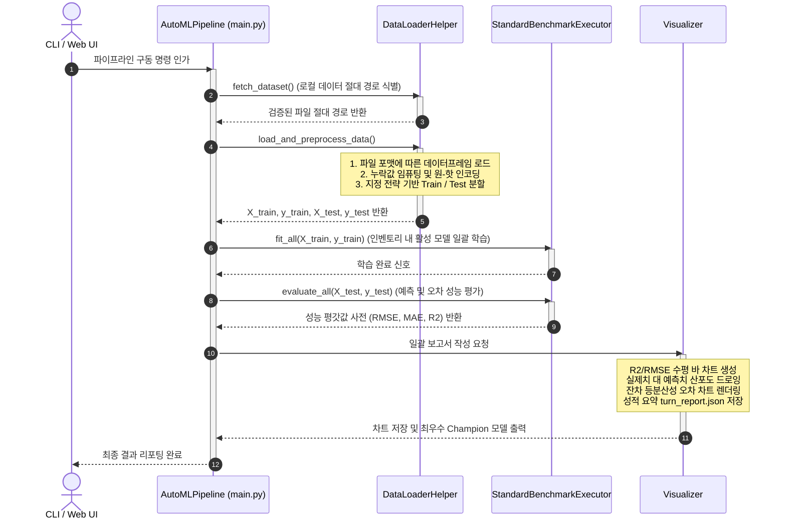

# [AutoML Regression Framework] 전체 아키텍처 상세 보고서 (Architecture Report)

본 보고서는 정형 데이터(Tabular Data)를 활용한 회귀 분석 성능을 극대화하고 자동화하는 **AutoML Regression Framework**의 소프트웨어 아키텍처와 구조적 설계 패턴, 모듈별 역할 및 데이터 흐름을 자연어로 상세하게 기술합니다.

---

## 1. 프레임워크 개요 (Overview)

본 프레임워크는 사용자가 기계학습 모델 훈련에 쏟는 코드 작성 및 실험 세팅 비용을 최소화하고, 단일 설정 파일(`config.yml`) 혹은 대화형 웹 인터페이스(WebUI) 제어만으로 정형 데이터 회귀 파이프라인을 완전히 자동 구동할 수 있도록 설계된 **생산 및 연구 친화형 AutoML 엔진**입니다.

### 1.1 설계 지향점
* **무코드 설정 및 오버라이드 지원**: 학습에 적용할 하이퍼파라미터나 전처리 옵션을 파이썬 코딩 없이 YAML 파일 조작만으로 일제 통제할 수 있습니다.
* **디자인 패턴 기반의 고도의 결합도 제어**: 각 도메인의 모듈들이 명확히 격리되어 있어, 향후 코드 베이스가 확장되더라도 유지보수가 극도로 용이합니다.
* **환경적 결함 감내 (Robust Execution)**: 기계학습 라이브러리 부재, 플랫폼 런타임 오류 등으로 인한 특정 모델 실행 장애가 전체 시스템 중단으로 이어지지 않도록 예외 안전망을 갖추고 있습니다.

---

## 2. 핵심 디자인 패턴 및 설계 사상 (Design Patterns)

구조적 확장성과 도메인 격리를 성취하기 위해 본 프레임워크는 네 가지 대표적인 소프트웨어 디자인 패턴을 융합하여 구현되었습니다.

### 2.1 퍼사드 패턴 (Facade Pattern)
* **적용 대상**: `DataLoaderHelper` 및 `AutoMLPipeline`
* **설명**: 클라이언트(메인 실행부 또는 WebUI)가 데이터 로딩, 전처리, 스플리팅, 모델 초기화, 학습, 평가 등의 복잡한 내부 서브시스템 상세 구현에 알 필요 없이, 단순하고 직관적인 몇 개의 상위 메인 메서드 호출만으로 전체 프로세스를 유연하게 작동할 수 있도록 단일 진입 인터페이스를 제공합니다.

### 2.2 전략 패턴 (Strategy Pattern)
* **적용 대상**: 데이터 분할기 (`splitters.py`) 및 모델 실행기 (`model_executor.py`)
* **설명**: 
  * **데이터 분할**: `TrainTestSplitter`, `KFoldSplitter`, `TimeSeriesSplitter`가 공통의 추상 전략 규격(`ABCDataSplitter`)을 따르고 있어 설정 파일의 분할 모드 문자열에 따라 동적으로 분할 알고리즘 전략이 전환됩니다.
  * **모델 실행**: 일괄 학습과 예측을 지휘하는 `StandardBenchmarkExecutor`를 제공하며, 향후 교차 검증용 실행기 등으로 전체 학습 흐름 전략을 교체할 때도 주입받는 `ModelPool`의 물리적 내부 구조 변경 없이 전략 실행기 클래스만 자유롭게 갈아끼울 수 있습니다.

### 2.3 어댑터 패턴 (Adapter Pattern)
* **적용 대상**: 개별 모델 래퍼 (`wrappers.py`)
* **설명**: 서로 다른 인터페이스 체계를 갖는 모델들(Scikit-Learn 기반 모델, XGBoost, CatBoost, 사전 학습된 TabPFN, PyTorch 기반의 Custom Transformer)을 단일한 규격의 `fit(X, y)` 및 `predict(X)` 형태로 감싸 안음으로써, 일괄 학습 실행기(`BenchmarkExecutor`)가 어떠한 예외 구분 없이 통일된 다형성 인터페이스로 모든 모델을 지휘할 수 있게 보장합니다.

### 2.4 데이터 인벤토리 패턴 (Pure Data Container)
* **적용 대상**: 모델 저장소 (`model_pool.py`)
* **설명**: 모델 인벤토리 보관 컴포넌트인 `ModelPool`은 실행이나 제어 성격의 로직을 일체 갖지 않고, 활성화된 모델 Wrapper 객체들의 딕셔너리를 관리하는 순수한 **자료 보관함(Repository Container)**의 역할만 수행하도록 책임을 격리했습니다.

---

## 3. 패키지 아키텍처 및 도메인 구조 (Directory & Domain Structure)

프로젝트 코드는 기능과 경계에 따라 독립적인 3대 서브 모듈과 제어 레이어로 격리 패키징되어 있습니다.

```text
automl_framework/
├── dataloader/      # 1. Data Ingestion & Preprocessing Domain
├── planner/         # 2. Dataset Diagnostics & Experiment Planning Domain
├── model/           # 3. Machine Learning Core Domain
└── util/            # 4. Analytics & Visualization Domain
```

### 3.1 Orchestration Layer (`main.py` & `configs/`)
* **역할**: CLI 명령줄 파싱 및 실행 오버라이드 조율, `AutoMLPipeline` 인스턴스 생성을 통한 전체 서브시스템 오케스트레이션 수행.
* **YAML 프로파일**: `configs/default.yml` 등 다양한 실험 구성을 관리하며 CLI 인수(`--target`, `--test-size` 등)를 통해 런타임에 동적으로 우선 반영되는 유연성을 제공합니다.

### 3.2 Data Domain (`automl_framework/dataloader/`)
* **`LocalFileDataLoader`**: 로컬의 CSV, TSV, Parquet는 물론 라인 단위 JSON Lines(`.jsonl`) 데이터셋 로딩을 담당합니다. 특히 JSONL 로딩 시 행마다 나타나는 동적 스키마(새로운 Key 컬럼 생성)를 런타임에 자동으로 결합 확장하고 결손 부분에 `NaN`을 매핑해 정렬해 주는 지능형 스키마 정렬 로딩 기능을 내장하고 있습니다.
* **`StandardDataPreprocessor`**: 결측치 매핑(수치형은 중앙값, 범주형은 최빈값 임퓨테이션)과 다중공선성 방지 규칙이 포함된 원-핫 인코딩(Dummy 변수화) 처리를 자동으로 수행합니다.
* **`DataLoaderHelper`**: 위의 데이터 로딩, 전처리, 학습/검증 분할 과정을 일괄 취합하여 최종 4대 행렬 변수(`X_train`, `y_train`, `X_test`, `y_test`)를 산출하는 실무 퍼사드 역할을 합니다.

### 3.3 Planning Domain (`automl_framework/planner/`)
* **`DataPlanner`**: 특정 데이터 디렉토리를 탐색(Scan)하여 지원 포맷 데이터 파일 목록과 크기 정보를 수집하고, 각 파일의 피처 컬럼 스키마 분석을 바탕으로 예측 대상 타겟(Target) 변수를 자동 추정하여 추천합니다. UI와 동적으로 연동되어 사용자가 개별 파일의 포함 여부를 필터링하고 타겟을 오버라이드 조율해 배치 실험을 안정적으로 구성할 수 있도록 지원합니다.

### 3.4 ML Domain (`automl_framework/model/`)
* **`ModelPool`**: 활성화된 회귀 알고리즘 모델 인벤토리를 생성 및 보관합니다.
* **`wrappers.py`**: RandomForest, MLP, XGBoost, CatBoost, TabPFN 및 Custom Transformer 등을 표준화된 인터페이스로 래핑하여 에러가 전파되지 않도록 보호막을 씌웁니다.
* **`architecture/transformer_encoder.py`**: PyTorch 기반의 시퀀스 기반 신경망 트랜스포머 회귀 알고리즘으로, 예측치 뿐만 아니라 확률적 평균/분산 분포까지 직접 모델링할 수 있는 심층 구조입니다.
* **`StandardBenchmarkExecutor`**: 모델 풀 안의 모든 어댑터에 대해 예외 상황을 감내하며 일괄 학습 루프를 돌리고, RMSE, MAE, R² 성능 지표 성적표를 사전에 기록해 반환합니다.

### 3.5 Presentation & Analytics Domain (`util/visualizer.py` & `app.py`)
* **`Visualizer`**: 고급 다크 슬레이트 테마 테마차트 규격을 강제 적용하여 실제치 vs 예측치 산점도, 잔차 분포 차트, 오차 비교 바 차트를 드로잉하고 실행 이력이 고스란히 담긴 표준 구조화 JSON 보고서를 출력합니다.
* **`app.py`**: Streamlit 대시보드를 구동하여 동적 폼 파싱, 다중 데이터셋 배치 계획 조율, 실시간 Subprocess 셸 로그 스트리밍을 제공하며, 격리된 데이터셋 결과 폴더(`outputs/[dataset_name]/`)를 드롭다운으로 전환해가며 시각화 분석 보고서를 동적으로 웹에 피딩해 줍니다.

---

## 4. 데이터 흐름 및 실행 시퀀스 (Data Flow Diagram)

프레임워크 기동 시 데이터가 전파되어 결과물을 생산하는 시퀀스는 아래 순서를 따릅니다.



---

## 5. 아키텍처적 특장점 및 견고성 (Robustness)

### 5.1 환경 파괴 감내 장치 (Exception Shielding)
일부 학습 환경에서 외부 기계학습 라이브러리(예: `xgboost`, `tabpfn`)가 누락되어 있거나, 하위 라이브러리의 런타임 공유 라이브러리 파일(예: macOS 환경의 `libomp.dylib` 링크 에러) 누락으로 기동 크래시가 유발될 경우에도, `ModelWrapper` 내부의 안전 블록이 런타임에 에러 원인을 조용히 경고 로그로 기록한 뒤 해당 결함 모델을 배제하고 가용한 정상 모델들로만 풀을 구축하여 실행의 생존을 책임집니다.

### 5.2 유연한 스플릿 및 동적 스키마 처리
* 교차 검증(`KFold`)이나 시계열 분석(`TimeSeries`)과 같이 다양한 시나리오에 필요한 복잡한 가변 크기의 행렬 조작 로직이 `Strategy` 하위 분할 객체로 은닉화되어 있어 결합도가 극도로 얇습니다.
* 사전에 명시되지 않은 필드가 비정기적으로 추가되어 들어오는 JSONL 포맷 데이터도 별도 변환 레이어 없이 `LocalFileDataLoader` 내부 정렬 판독 루틴을 통해 자동으로 정합성을 맞춥니다.
