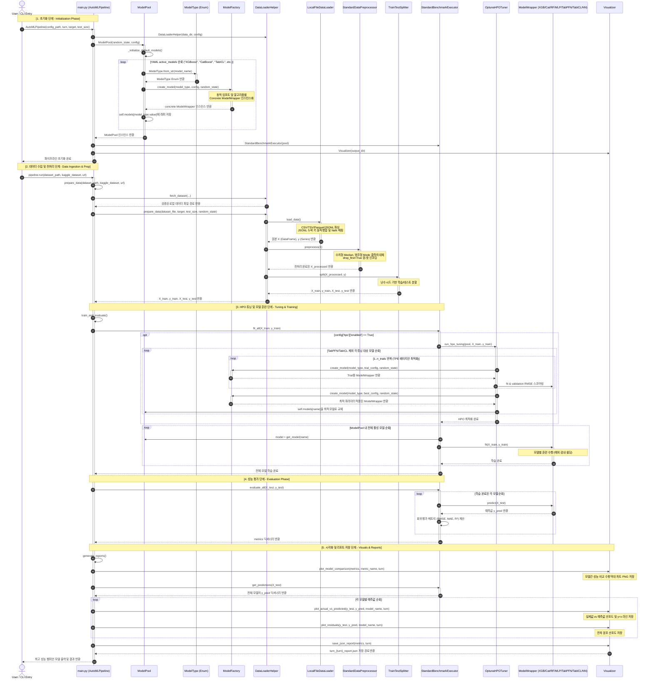
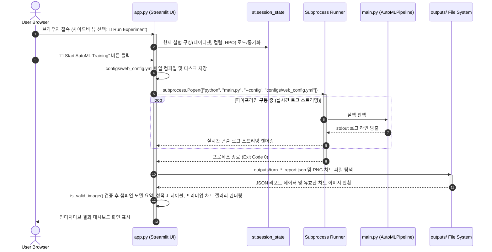

# 📊 AutoML Regression Framework - Comprehensive Sequence Diagrams

본 문서는 **AutoML Regression Framework**의 파이프라인 전체 실행 제어 흐름, Optuna HPO 하이퍼파라미터 최적화 루프, 그리고 Streamlit WebUI 상호작용 흐름을 Mermaid 시퀀스 다이어그램으로 상세히 기술한 **동적 모델 설계서**입니다.

---

## 1. End-to-End AutoML Pipeline Sequence Diagram

CLI 또는 라이브러리 호출 시 `AutoMLPipeline`을 중심으로 초기화 -> 데이터 준비 -> Optuna HPO & 모델 훈련 -> 성능 평가 -> 프리미엄 차트 생성 및 리포트 저장까지의 전체 순차 흐름입니다.

---

## 2. Streamlit WebUI Interaction Sequence Diagram

사용자가 Streamlit WebUI(`app.py`)에서 설정을 조작하고 실험을 실행하여 실시간 결과를 확인하는 상호작용 흐름입니다.

