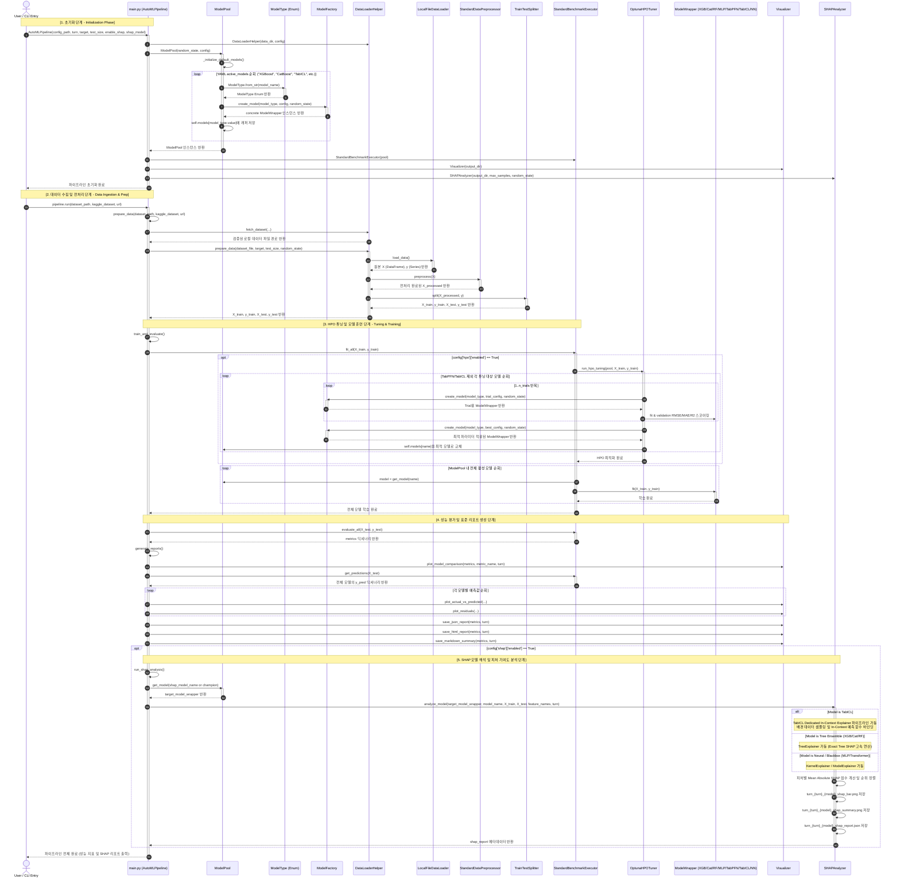

# 📊 AutoML Regression Framework - Comprehensive Sequence Diagrams

본 문서는 **AutoML Regression Framework**의 파이프라인 전체 실행 제어 흐름, Optuna HPO 하이퍼파라미터 최적화 루프, SHAP 모델 해석 및 피처 기여도 분석 흐름, 그리고 Streamlit WebUI 상호작용 흐름을 Mermaid 시퀀스 다이어그램으로 기술한 **동적 모델 설계서**입니다.

---

## 1. End-to-End AutoML Pipeline Sequence Diagram

