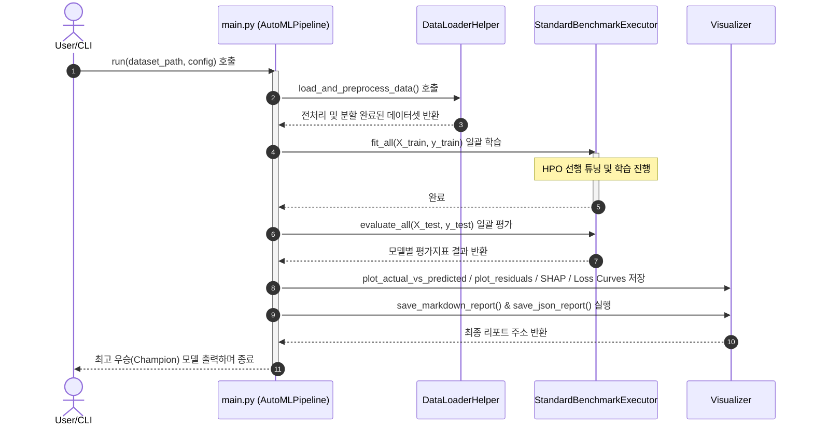
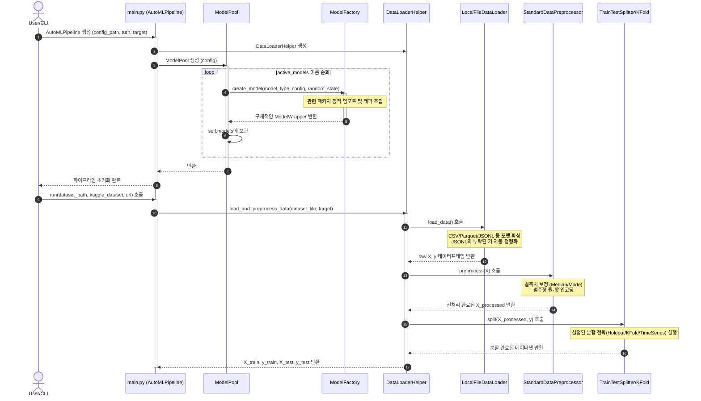
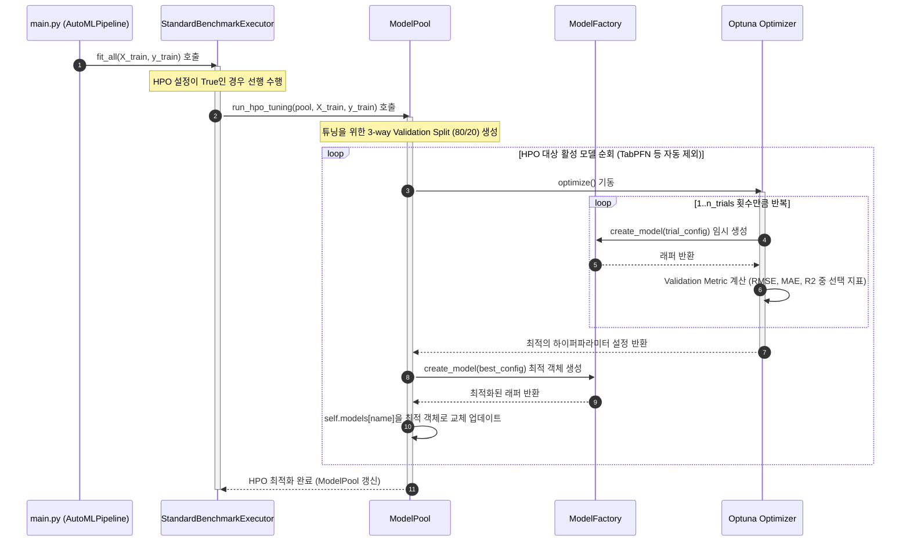
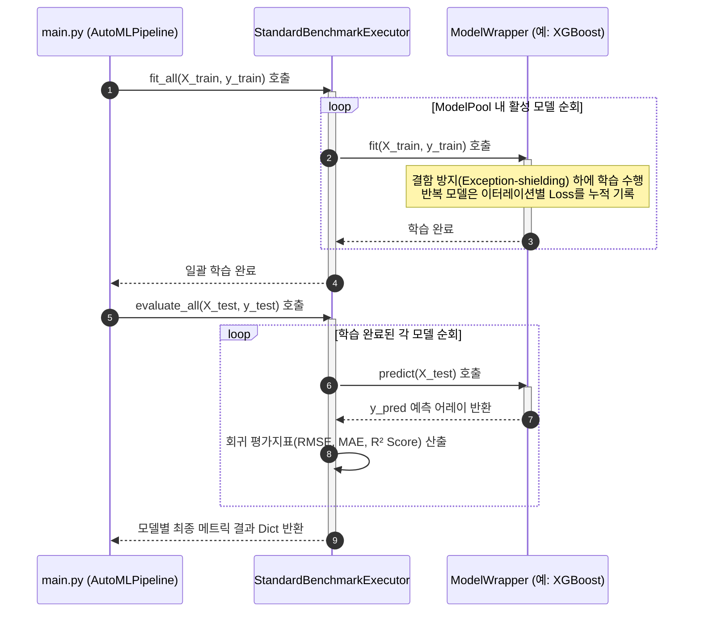
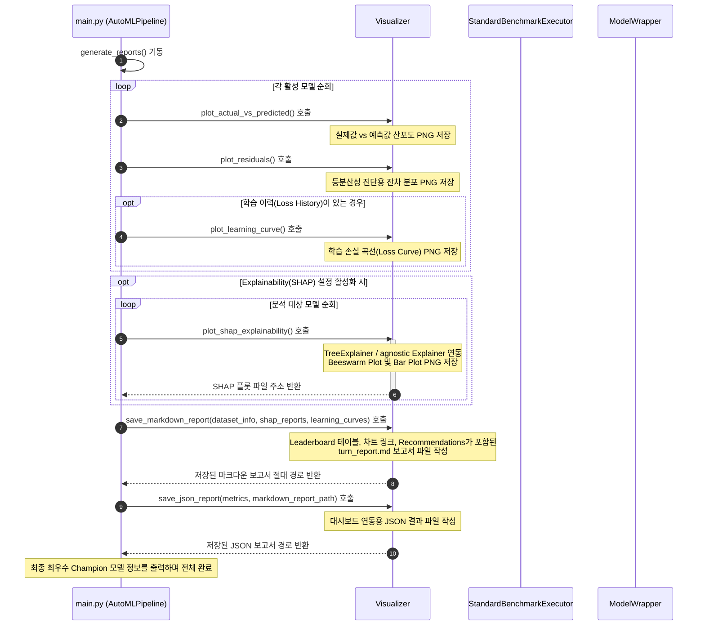

# 📊 AutoML Regression Framework - 시퀀스 다이어그램 (Sequence Diagrams)

본 문서는 **Regression Model Revolution Framework**의 핵심 실행 흐름을 쉽게 이해할 수 있도록 **전체 요약 흐름도**와 **기능 단계별 세부 시퀀스 다이어그램**으로 분할하여 제공합니다.

---

## 1. 🏆 전체 요약 흐름도 (High-Level Pipeline Workflow)

이 다이어그램은 전체 실행의 전체 라이프사이클을 고수준에서 요약해 보여줍니다.

---

## 2. 📥 [1단계] 초기화 및 데이터 전처리 (Initialization & Data Preparation)

설정 파일 파싱, `ModelPool`의 `ModelFactory` 기반 동적 생성, 그리고 원본 데이터 수집 및 정형 전처리/스플릿 분할 프로세스입니다.
- **적용 패턴**: 
  - **[팩토리 메서드 패턴]**: `ModelFactory`를 활용해 활성 모델 래퍼 인스턴스를 빌드합니다. ([Refactoring Guru 공식 설명 참조](https://refactoring.guru/ko/design-patterns/factory-method))
  - **[퍼사드 패턴]**: `DataLoaderHelper` 및 `AutoMLPipeline`이 하위 모듈 호출을 감싸 단일 진입점을 제공합니다. ([Refactoring Guru 공식 설명 참조](https://refactoring.guru/ko/design-patterns/facade))
  - **[전략 패턴]**: 분할 방식을 동적 교체합니다. ([Refactoring Guru 공식 설명 참조](https://refactoring.guru/ko/design-patterns/strategy))

---

## 3. 🎯 [2단계] 하이퍼파라미터 최적화 (Hyperparameter Optimization - HPO)

파이프라인 실행 시 HPO가 활성화되었을 때 **Optuna**를 활용해 가변 평가지표를 기반으로 최적의 모델 하이퍼파라미터를 탐색 및 갱신하는 단계입니다.
- **적용 패턴**: 
  - **[팩토리 메서드 패턴]**: 튜닝용 임시 인스턴스 빌드에 사용됩니다.

---

## 4. 🤖 [3단계] 일괄 학습 및 스코어링 (Model Training & Evaluation)

갱신된 모델 풀을 대상으로 학습을 수행하고, 테스트 데이터를 활용해 최종 평가지표를 도출합니다.
- **적용 패턴**: 
  - **[어댑터 패턴]**: 외부 머신러닝 모듈들의 규격을 표준 규격으로 정렬합니다. ([Refactoring Guru 공식 설명 참조](https://refactoring.guru/ko/design-patterns/adapter))
  - **[전략 패턴]**: 교체 가능한 실행 전략으로 다형적으로 운영합니다.

---

## 5. 🧠 [4단계] 시각화, SHAP 분석 및 보고서 작성 (Visualization, SHAP & Reporting)

평가가 종료된 후 결과 차트, SHAP 변수 중요도 분석, 학습 곡선(Loss Curve) 이미지를 생성하고 전문 보고서 파일 2종을 디스크에 저장합니다.

