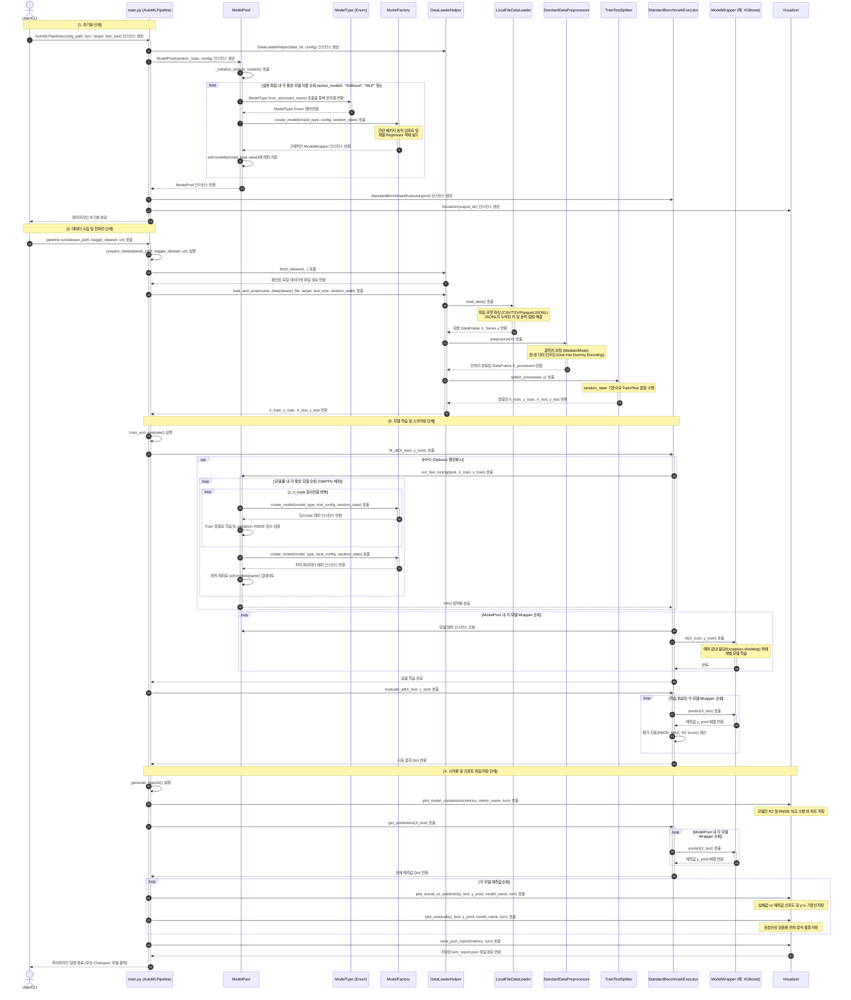

# 📊 AutoML Regression Framework - 전체 시퀀스 다이어그램 (Full Sequence Diagram)

본 문서는 모델 생성을 위해 새로 리팩토링된 **팩토리 메서드(Factory Method)** 디자인 패턴을 포함하여, **Regression Model Revolution Framework**의 전체 파이프라인 워크플로우를 보여주는 종합 시퀀스 다이어그램을 제공합니다.

---

## 🗺️ Mermaid 시퀀스 다이어그램

아래는 초기화, 데이터 로드/전처리, 학습, 평가 및 시각화 프로세스를 설명하는 전체 시퀀스 다이어그램입니다.

