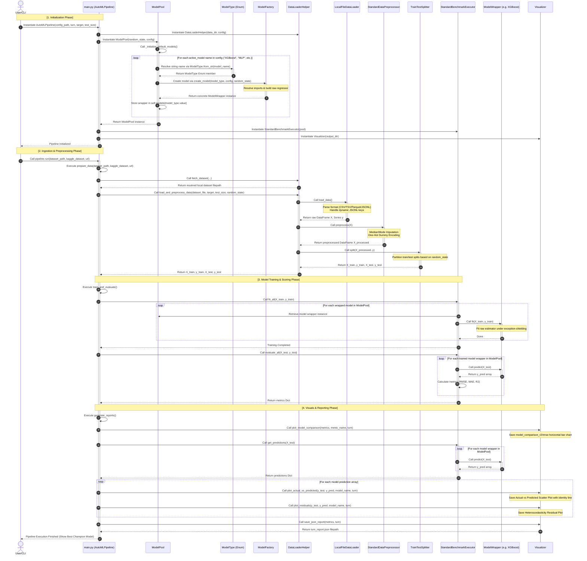

# 📊 AutoML Regression Framework - Full Sequence Diagram

This document contains a comprehensive sequence diagram representing the entire workflow of the **Regression Model Revolution Framework**, including the newly refactored **Factory Method** design pattern for model creation.

---

## 🗺️ Mermaid Sequence Diagram

Below is the complete sequence diagram mapping out initialization, data loading/preprocessing, training, evaluation, and visualization.

